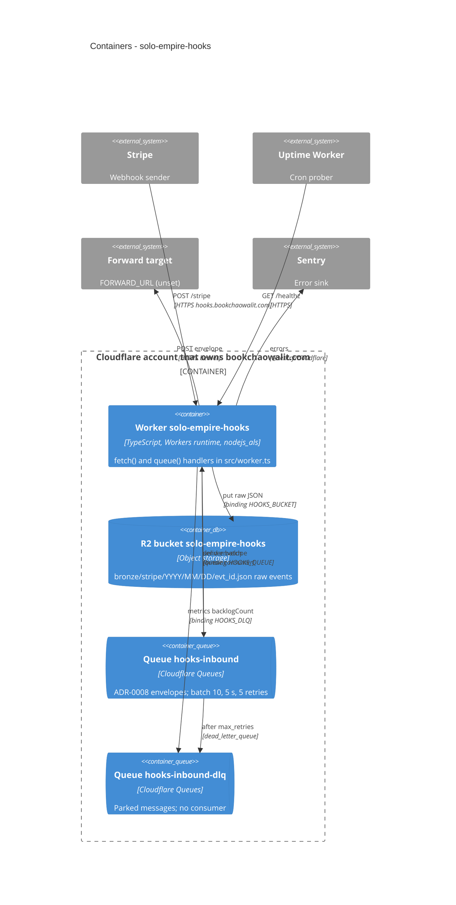

# 06 — C4 Container

```mermaid
C4Container
  title Containers - solo-empire-hooks
  System_Ext(stripe, "Stripe", "Webhook sender")
  System_Ext(uptime, "Uptime Worker", "Cron prober")
  System_Ext(target, "Forward target", "FORWARD_URL (unset)")
  System_Ext(sentry, "Sentry", "Error sink")
  Container_Boundary(cfb, "Cloudflare account that owns bookchaowalit.com") {
    Container(worker, "Worker solo-empire-hooks", "TypeScript, Workers runtime, nodejs_als", "fetch() and queue() handlers in src/worker.ts")
    ContainerDb(r2, "R2 bucket solo-empire-hooks", "Object storage", "bronze/stripe/YYYY/MM/DD/evt_id.json raw events")
    ContainerQueue(q, "Queue hooks-inbound", "Cloudflare Queues", "ADR-0008 envelopes; batch 10, 5 s, 5 retries")
    ContainerQueue(dlq, "Queue hooks-inbound-dlq", "Cloudflare Queues", "Parked messages; no consumer")
  }
  Rel(stripe, worker, "POST /stripe", "HTTPS hooks.bookchaowalit.com")
  Rel(worker, r2, "put raw JSON", "binding HOOKS_BUCKET")
  Rel(worker, q, "send envelope", "binding HOOKS_QUEUE")
  Rel(q, worker, "deliver batch", "queue consumer")
  Rel(q, dlq, "after max_retries", "dead_letter_queue")
  Rel(worker, dlq, "metrics backlogCount", "binding HOOKS_DLQ")
  Rel(worker, target, "POST envelope", "HTTPS bearer")
  Rel(uptime, worker, "GET /healthz", "HTTPS")
  Rel(worker, sentry, "errors", "@sentry/cloudflare")
```

Sources: `wrangler.toml`, `src/worker.ts`, `src/sentry.ts`, `package.json`; DLQ consumers = 0 จาก `wrangler queues info hooks-inbound-dlq` (รัน 2026-11-03)
