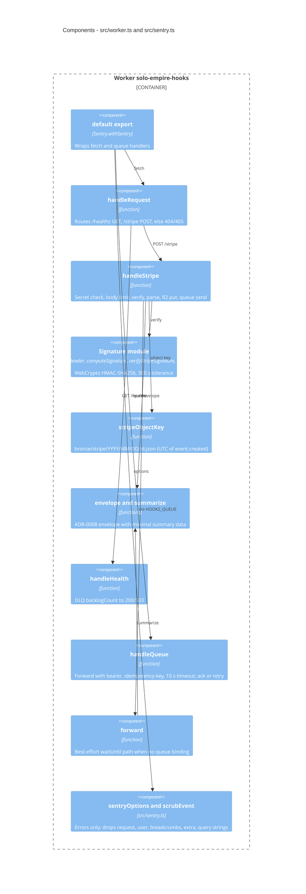

# 07 — C4 Component (inside the Worker)

```mermaid
C4Component
  title Components - src/worker.ts and src/sentry.ts
  Container_Boundary(w, "Worker solo-empire-hooks") {
    Component(entry, "default export", "Sentry.withSentry", "Wraps fetch and queue handlers")
    Component(router, "handleRequest", "function", "Routes /healthz GET, /stripe POST, else 404/405")
    Component(stripeh, "handleStripe", "function", "Secret check, body limit, verify, parse, R2 put, queue send")
    Component(sig, "Signature module", "parseSignatureHeader, computeSignature, verifyStripeSignature, timingSafeEqual", "WebCrypto HMAC-SHA256, 300 s tolerance")
    Component(keys, "stripeObjectKey", "function", "bronze/stripe/YYYY/MM/DD/id.json (UTC of event.created)")
    Component(env, "envelope and summarize", "functions", "ADR-0008 envelope with minimal summary data")
    Component(health, "handleHealth", "function", "DLQ backlogCount to 200/503")
    Component(consumer, "handleQueue", "function", "Forward with bearer, idempotency-key, 10 s timeout; ack or retry")
    Component(legacy, "forward", "function", "Best-effort waitUntil path when no queue binding")
    Component(sopt, "sentryOptions and scrubEvent", "src/sentry.ts", "Errors only; drops request, user, breadcrumbs, extra, query strings")
  }
  Rel(entry, router, "fetch")
  Rel(entry, consumer, "queue")
  Rel(entry, sopt, "options")
  Rel(router, stripeh, "POST /stripe")
  Rel(router, health, "GET /healthz")
  Rel(stripeh, sig, "verify")
  Rel(stripeh, keys, "object key")
  Rel(stripeh, env, "envelope")
  Rel(stripeh, legacy, "no HOOKS_QUEUE")
  Rel(legacy, env, "summarize")
```

Sources: `src/worker.ts`, `src/sentry.ts`
